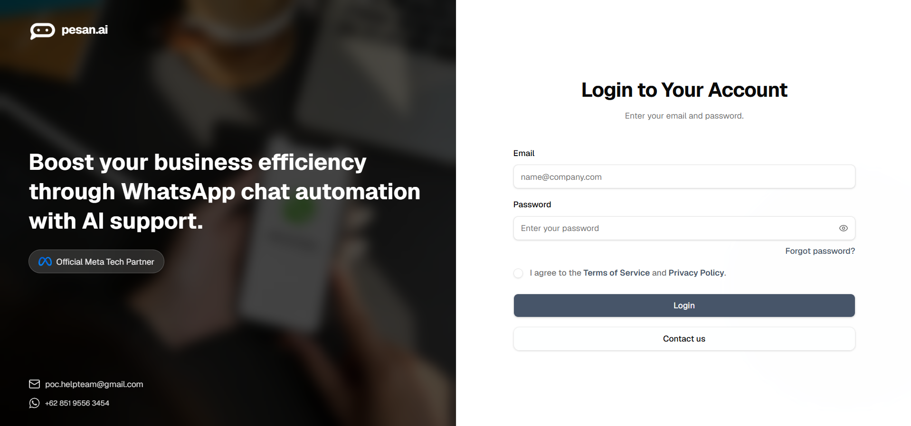

# Sign In

You can sign in to pesan.ai after the pesan.ai team has created and activated your account.

Users cannot create an account directly from the dashboard. If you do not have an account yet, book a consultation first.

## Before you begin

Make sure you already have:

- An account created by the pesan.ai team.
- The email address assigned to your account.
- The password or sign-in details provided by the team.

## Sign in flow

1. **Open the login page.** Open the pesan.ai login page. If you do not have access yet, click **Contact us** to request access.

2. **Enter your credentials.** Enter the **Email** and **Password** provided by the pesan.ai team.

3. **Accept the Terms and Privacy notice.** Check the agreement box after reviewing the **Terms of Service** and **Privacy Policy** links on the login form.

4. **Click Login.** After entering your credentials, click **Login**.

## Expected result

If your credentials are correct and your account is active, you will be redirected to the pesan.ai dashboard.

## If you cannot sign in

If you cannot sign in, check that:

- You are using the correct email address.
- Your password is correct.
- Your account has already been activated by the pesan.ai team.
- You have accepted the Terms and Privacy notice on the login form.

If the issue continues, contact the pesan.ai team for help.
