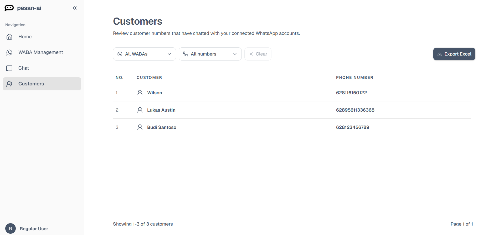

# Customers Overview

The Customers page shows customer numbers or contacts that have interacted with your connected WhatsApp Business Accounts.

From this page, you can:

- Review saved customer contacts.
- Filter contacts by WABA.
- Filter contacts by WhatsApp number.
- Export customer data to Excel.

## When customer data appears

Customer data is available after WhatsApp accounts are connected and customer interactions are recorded by Pesan AI.

The visible information may depend on the connected WhatsApp account and the data available in the system.

## If the Customers page is empty

This can happen if:

- No customer has chatted with the connected WhatsApp account yet.
- The selected WABA filter has no contacts.
- The selected number filter has no contacts.
- The WhatsApp Business Account is not connected correctly.

Click **Clear** to remove filters, then check **WABA Management** to confirm the account status.

## Table columns

The Customers table shows:

| Column | Meaning |
|---|---|
| No. | The row number in the current list. |
| Customer | The customer name when available, or a fallback customer label. |
| Phone Number | The customer's WhatsApp phone number. |
