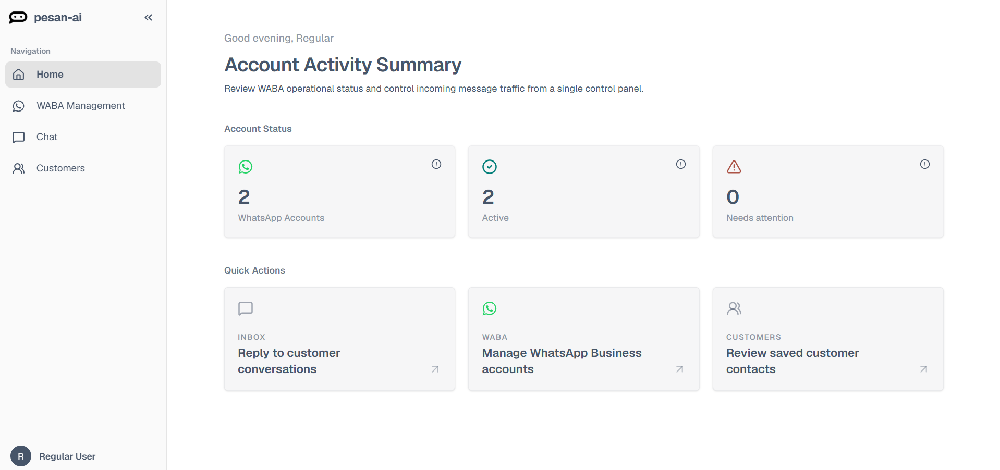

# Home Overview

The Home page gives you a quick summary of your pesan.ai account and WhatsApp Business activity.

## Account Activity Summary

The **Account Activity Summary** helps you review WABA operational status and control incoming message traffic from a single dashboard.

The exact data shown may depend on your connected WhatsApp Business Accounts and account setup.

## Account Status

The **Account Status** section shows the current condition of your connected WhatsApp Business Accounts.

| Card | Meaning |
|---|---|
| WhatsApp Accounts | Total WhatsApp Business Accounts connected to pesan.ai. |
| Active | Accounts that can process incoming and outgoing messages normally. |
| Needs attention | Accounts that may be disconnected, suspended, blocked, or need Meta verification. |

## Quick Actions

The **Quick Actions** section provides shortcuts to important parts of the dashboard.

| Action | Description |
|---|---|
| Reply to customer conversations | Opens the Chat page for customer conversations. |
| Manage WhatsApp Business accounts | Opens WABA Management. |
| Review saved customer contacts | Opens the Customers page. |

## When to use this page

Use the Home page when you want to quickly check whether your WhatsApp Business setup is active and decide which part of the dashboard to open next.
