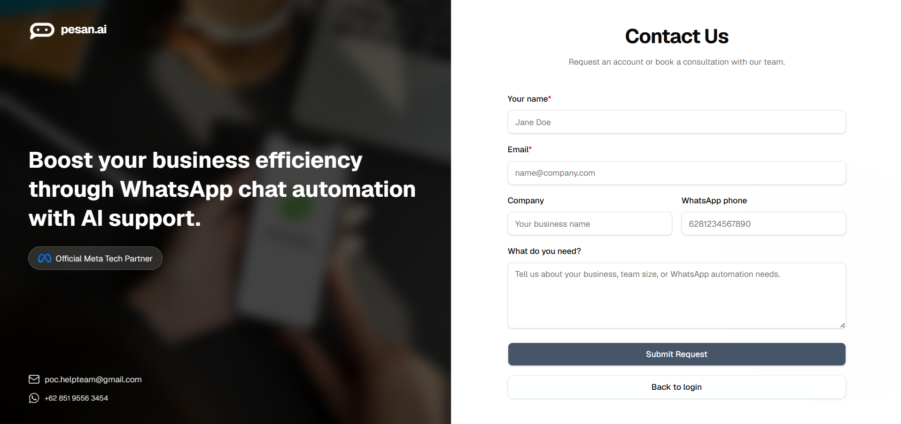

# Book a Consultation

Before using Pesan AI, you need to request access or book a consultation with the Pesan AI team.

The consultation is free and helps the team understand your business needs before inviting you to create account access.

## How to request consultation

1. **Open the Contact Us page.** Open **Contact us** from the login page, or choose **Book a Consultation** from the public website. This page is used to request an account or book a consultation with the Pesan AI team.

2. **Fill in your contact information.** Use active business contact information so the team can reach the right person.

| Field | Description |
|---|---|
| Your name | Your full name or the person responsible for the request. |
| Email | Your active email address. |
| Company | Your business or company name. |
| WhatsApp phone | The WhatsApp number the team can contact. |
| What do you need? | A short explanation of your business, team size, or WhatsApp automation needs. |

3. **Explain what you need.** Use the **What do you need?** field to briefly explain what you want Pesan AI to help with.

For example, you can mention that you want to:

- Connect your WhatsApp Business account to Pesan AI.
- Automate repetitive customer replies.
- Prepare an AI Agent for customer service or sales inquiries.
- Let your team monitor WhatsApp conversations from a web dashboard.
- Collect and export customer contacts from WhatsApp conversations.
- Ask whether you should use an existing WhatsApp Business App account or create a new WhatsApp Business Account.

The more context you provide, the easier it is for the Pesan AI team to recommend the right setup.

4. **Submit your request.** After filling in the form, click **Submit Request**.

5. **Wait for the team to contact you.** After your request is submitted, the Pesan AI team will contact you through WhatsApp or email. The team will discuss your needs, confirm the service details, and guide you through the next steps.

> [!NOTE]
> Submitting the consultation form does not automatically create Pesan AI dashboard access. After the consultation, agreement, and payment process are completed, the Pesan AI team will invite your email address. Use the registration link in that email to set your password and finish account setup.
