# Use an Existing WhatsApp Business App Account

This guide explains how to connect an existing WhatsApp Business App account to pesan.ai using coexistence mode.

Coexistence allows you to keep using your WhatsApp Business App while connecting the same number to the WhatsApp Business Platform for use with pesan.ai.

This option is useful if your business already uses WhatsApp Business App and does not want to immediately replace the existing app workflow.

## Before you begin

Make sure:

- You can access the Facebook account that manages the business assets.
- You know which business portfolio should be connected.
- You have the WhatsApp Business phone nearby.
- The WhatsApp Business App can receive messages from Facebook Business.
- You are using the correct business phone number.

## Coexistence setup flow

1. **Start the Meta onboarding flow.** From **WABA Management**, click **Connect WhatsApp account**. A Facebook Login for Business popup will appear. Click **Continue**.

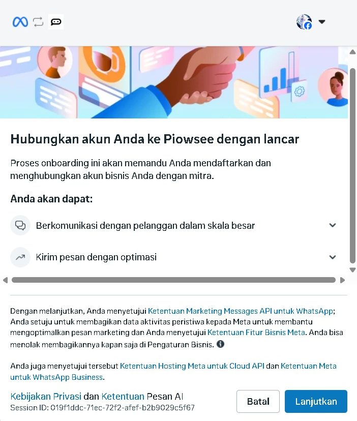

2. **Select your business portfolio.** Choose the business portfolio you want to share with pesan.ai. If you already have a business portfolio, select the correct one from the list.

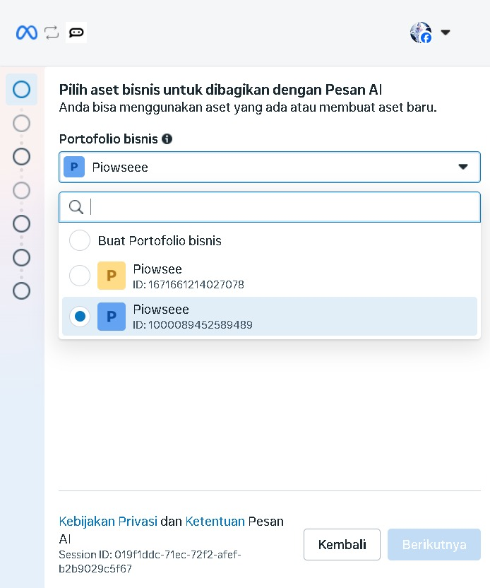

**If this happens:** If you selected the wrong business portfolio and the popup still allows changes, go back and choose the correct one. If not, close the popup and restart from **WABA Management**. Choose the business portfolio that owns or manages the WhatsApp Business account you want to connect.

3. **Choose the existing WhatsApp Business App option.** When asked to choose the WhatsApp Business setup option, select the option to connect an existing WhatsApp Business App account.

This option may appear as **Connect an existing WhatsApp Business App account**, **Hubungkan Aplikasi WhatsApp Business**, or similar wording depending on the language shown by Meta.

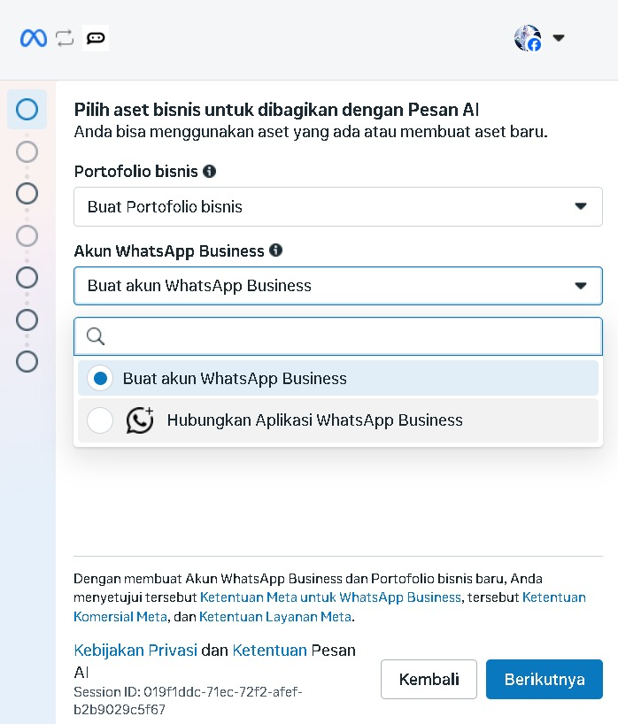

4. **Enter your WhatsApp Business phone number.** Select the country code and enter the WhatsApp Business phone number you want to connect. Make sure the phone number is the correct business number.

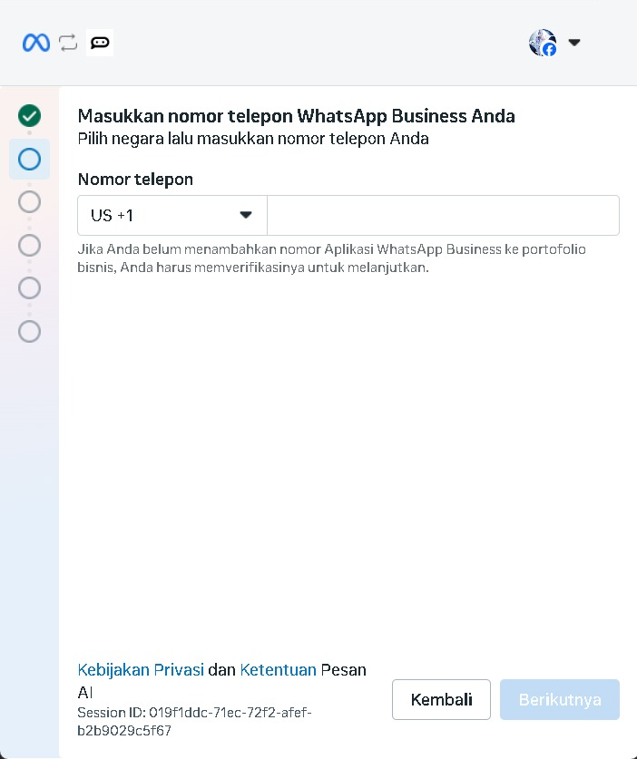

5. **Review the connection information.** Meta will show information about connecting your existing WhatsApp Business App account to the Business Platform. Review the information, then click **Next** or **Berikutnya**.

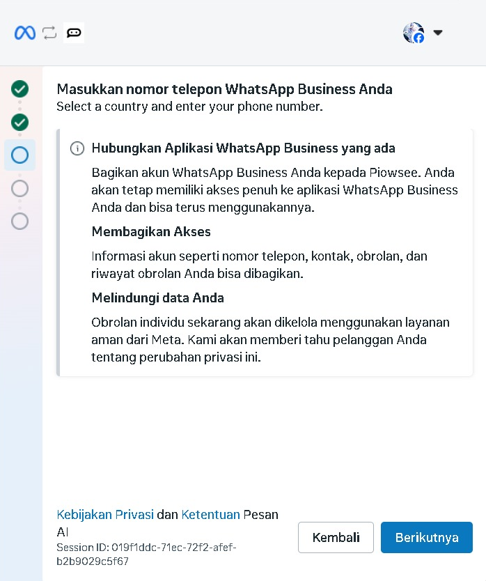

6. **Continue from WhatsApp Business App.** If a QR code or access code appears, open your WhatsApp Business App on your phone and continue the connection process from there.

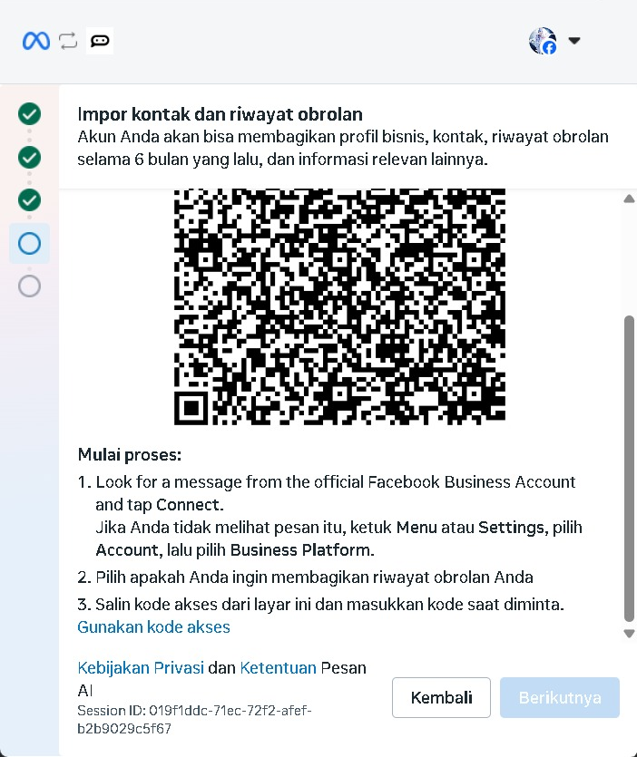

**If this happens:** Follow the instruction shown in the Meta onboarding screen. Keep the WhatsApp Business App open on your phone and continue from there.

7. **Open the Facebook Business message.** In WhatsApp, open the message from **Facebook Business**. Tap the connect button in the message.

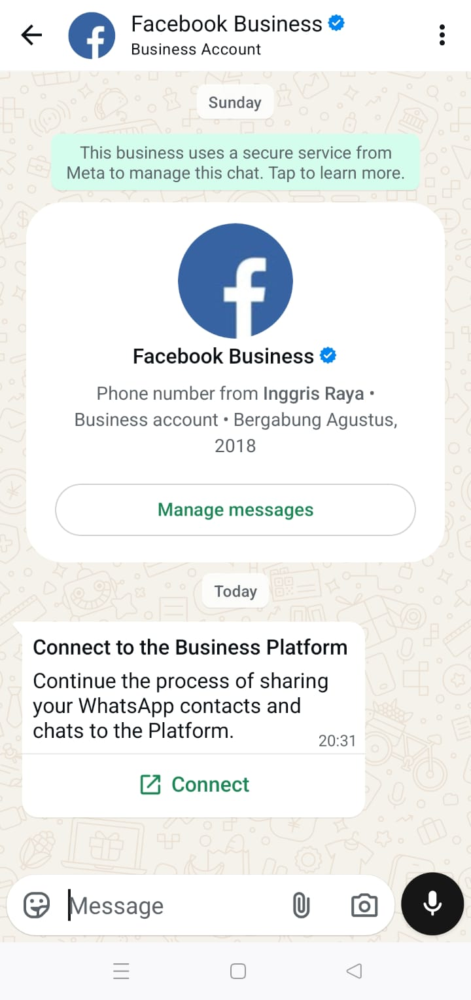

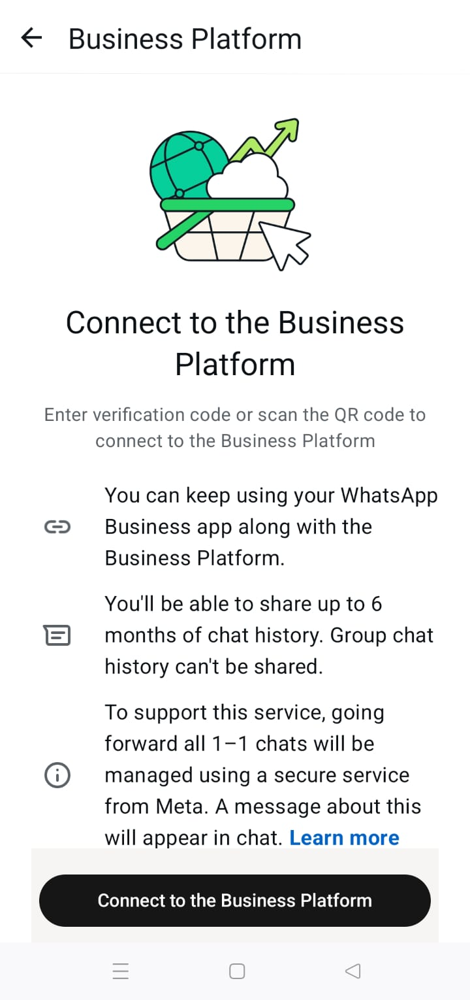

**If this happens:** If the Facebook Business message does not appear, check that the phone number is correct, active in WhatsApp Business App, connected to the internet, and able to receive messages. If it still does not appear, restart from **WABA Management** or contact the pesan.ai team.

8. **Connect to the Business Platform.** On your phone, tap **Connect to the Business Platform**. Depending on the language shown, this may appear as **Hubungkan** or similar wording.

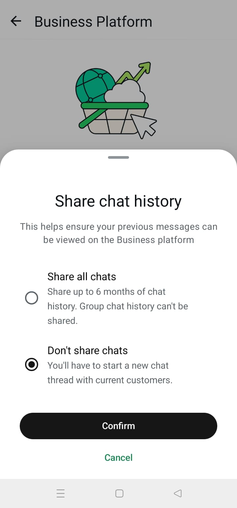

9. **Choose chat history sharing option.** When asked whether to share chat history, choose **Don't share chats**.

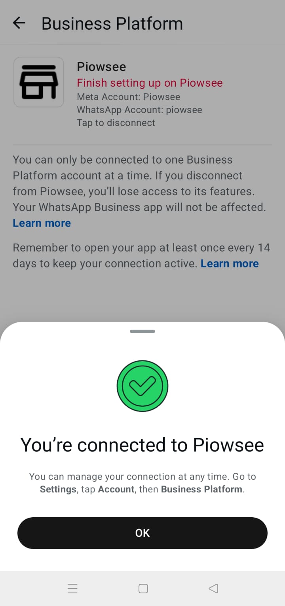

**Important:** pesan.ai currently does not support chat history sync. Choose **Don't share chats** during this step.

If you accidentally selected **Share all chats**, contact the pesan.ai team before continuing.

10. **Return to the Meta onboarding popup.** Back in the Meta onboarding popup, confirm or edit your WhatsApp Business account details, such as account name and time zone.

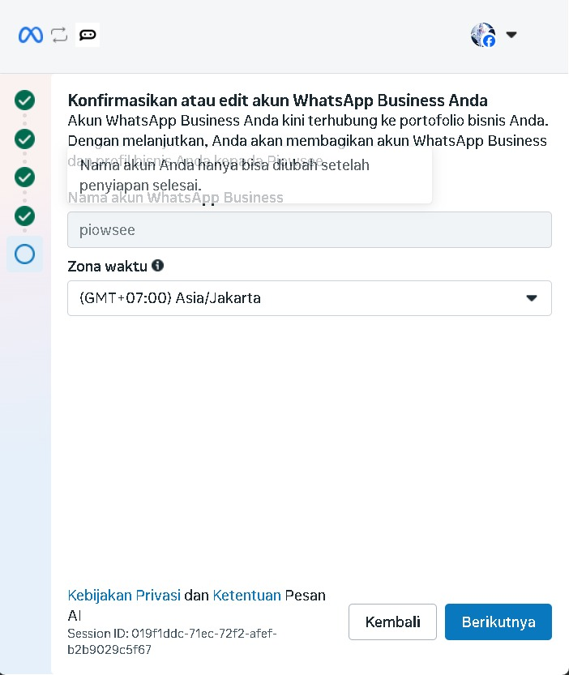

11. **Review permissions.** Review what pesan.ai can access and do with the connected WhatsApp Business Account. If everything is correct, click **Confirm** or **Konfirmasi**.

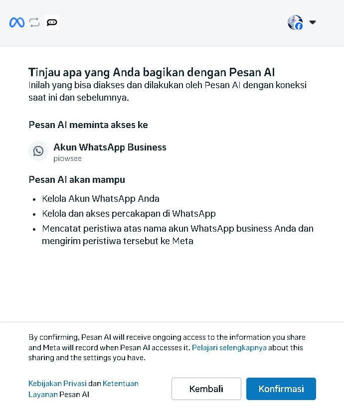

12. **Finish setup.** When the account is connected, click **Done**, **Finish**, or **Selesai**.

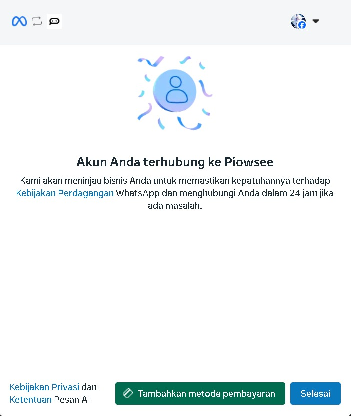

13. **Check WABA Management.** Return to pesan.ai and open WABA Management. Your connected WhatsApp Business Account should appear in the account list.

## Notes

- Keep the WhatsApp phone nearby during the setup process.
- Make sure the number is the correct business number.
- The phone must be able to receive WhatsApp messages from Facebook Business.
- If the popup closes or the connection fails, restart the connection from WABA Management.
- Use **Don't share chats** because chat history sync is not currently supported.
