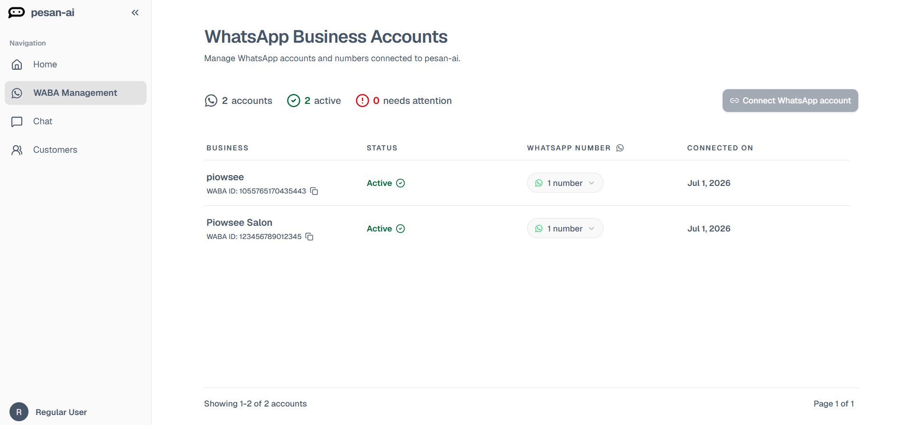

# WABA Management Overview

WABA Management is where you connect and manage WhatsApp Business Accounts used by Pesan AI.

This step is important because Pesan AI needs a connected WhatsApp Business Account before it can receive WhatsApp conversation data, display account status, manage customer contacts, and support AI-assisted message automation.

## What you can do on this page

From WABA Management, you can:

- View connected WhatsApp Business Accounts.
- Check account status.
- Review connected WhatsApp phone numbers.
- Connect a new WhatsApp account.
- Identify accounts that need attention.

## Account summary

At the top of the page, you can see a summary of your WhatsApp Business setup.

| Summary | Meaning |
|---|---|
| accounts | Total WhatsApp Business Accounts connected to Pesan AI. |
| active | Connected accounts that are currently active. |
| needs attention | Accounts that require action or review. |

## Account table

The account table shows each connected business, its status, WhatsApp number, and connection date.

Use this table to confirm whether your WhatsApp Business Account has been connected successfully.
